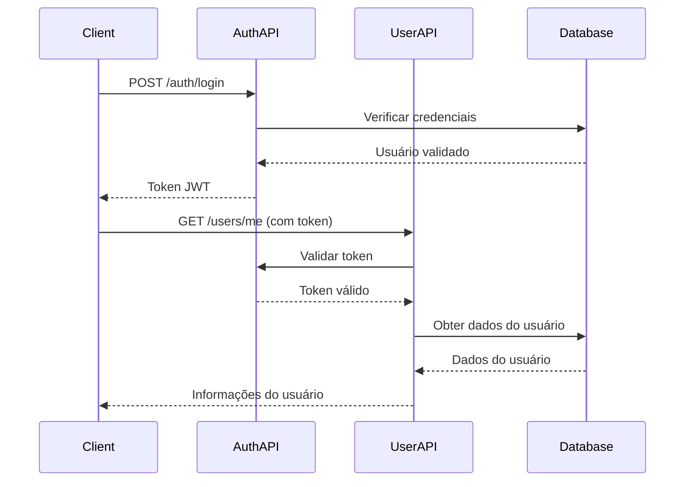

# Diretório API 📡

Este diretório contém a camada de API da aplicação, organizando todos os endpoints REST e lógica de roteamento.

## 🎯 Propósito

O diretório `api/` trata todas as requisições e respostas HTTP, servindo como interface entre clientes externos e a lógica de negócio da aplicação.

## 📁 Estrutura do Diretório

```
api/
├── __init__.py          # Inicialização do pacote
└── v1/                  # API versão 1
    ├── __init__.py      # Inicialização do pacote de versão
    ├── api.py           # Configuração do roteador principal da API
    ├── auth_routes.py   # Endpoints de autenticação
    └── user_routes.py   # Endpoints de gerenciamento de usuário
```

## 📄 Visão Geral dos Arquivos

### `v1/api.py` - Roteador Principal da API
**Propósito**: Roteador central que combina todos os endpoints da API

**O que faz**:
- Cria o roteador principal da API para versão 1
- Inclui rotas de autenticação (`/auth`)
- Inclui rotas de gerenciamento de usuário (`/users`)  
- Fornece um ponto único de entrada para todos os endpoints da API

**Para iniciantes**: Pense nisso como o "diretor de trânsito" que decide qual endpoint trata qual requisição.

### `v1/auth_routes.py` - Endpoints de Autenticação
**Propósito**: Trata login, logout e autenticação de usuário

**Endpoints disponíveis**:
- `POST /auth/login` - Login de usuário com nome de usuário/senha
- `POST /auth/logout` - Logout de usuário (invalida token)
- `GET /auth/me` - Obter informações do usuário atual

**O que faz**:
- Valida credenciais do usuário
- Cria tokens JWT para autenticação
- Gerencia blacklist de tokens para segurança
- Retorna informações do usuário para usuários autenticados

**Para iniciantes**: É aqui que os usuários "fazem login" para usar o app. Verifica se a senha está correta e dá a eles um "ingresso" (token JWT) para acessar recursos protegidos.

### `v1/user_routes.py` - Endpoints de Gerenciamento de Usuário
**Propósito**: Trata todas as operações relacionadas ao usuário (CRUD)

**Endpoints disponíveis**:
- `POST /users` - Criar nova conta de usuário
- `GET /users/{username}` - Obter informações do usuário
- `PUT /users/{username}` - Atualizar perfil do usuário
- `DELETE /users/{username}` - Deletar conta do usuário
- `PUT /users/{username}/password` - Alterar senha do usuário

**O que faz**:
- Cria novas contas de usuário
- Recupera perfis de usuário
- Atualiza informações do usuário
- Deleta contas de usuário
- Trata mudanças de senha de forma segura

**Para iniciantes**: É como um "gerenciador de usuário" que permite criar contas, visualizar perfis, atualizar informações e deletar contas.

## 🔑 Fluxo de Autenticação



## 🛡️ Recursos de Segurança

### Autenticação Obrigatória
A maioria dos endpoints requer autenticação:
```python
# Exemplo de endpoint protegido
@router.get("/users/{username}")
async def get_user(
    username: str,
    current_user: User = Depends(get_current_user)  # ← Autenticação obrigatória
):
```

### Validação de Entrada
Todas as entradas são validadas usando modelos Pydantic:
```python
# Validação de requisição
@router.post("/users")
async def create_user(user_data: UserRequest):  # ← Valida entrada automaticamente
```

### Tratamento de Erros
Respostas de erro consistentes:
- `400` - Requisição Inválida (entrada inválida)
- `401` - Não Autorizado (sem token ou token inválido)
- `403` - Proibido (token válido, mas sem permissão)
- `404` - Não Encontrado (usuário não existe)
- `409` - Conflito (nome de usuário já existe)

## 🧩 Como Se Conecta

### Fluxo de Entrada
```
Requisição HTTP → FastAPI → Roteador API → Função Endpoint → Camada de Serviço → Banco de Dados
```

### Fluxo de Resposta
```
Banco de Dados → Camada de Serviço → Função Endpoint → Modelo Pydantic → Resposta JSON
```

## 📝 Exemplos de Uso

### Criando um Usuário
```bash
curl -X POST "http://localhost:8000/api/v1/users" \
  -H "Content-Type: application/json" \
  -d '{
    "username": "joaosilva",
    "password": "SenhaSegura123!",
    "age": 25,
    "description": "Desenvolvedor de software"
  }'
```

### Login
```bash
curl -X POST "http://localhost:8000/api/v1/auth/login" \
  -H "Content-Type: application/json" \
  -d '{
    "username": "johndoe",
    "password": "SecurePass123!"
  }'
```

### Get User Info (with authentication)
```bash
curl -X GET "http://localhost:8000/api/v1/users/johndoe" \
  -H "Authorization: Bearer YOUR_JWT_TOKEN_HERE"
```

## 🔧 For Developers

### Adding New Endpoints
1. Choose the appropriate router file (`auth_routes.py` or `user_routes.py`)
2. Add your endpoint function with proper decorators
3. Use Pydantic models for request/response validation
4. Add authentication dependency if needed
5. Handle errors appropriately
6. Update the router in `api.py` if needed

### Best Practices
- Always validate input using Pydantic models
- Use proper HTTP status codes
- Add authentication to protected endpoints
- Handle errors gracefully
- Document your endpoints with docstrings
- Keep business logic in the service layer

## 🎓 Learning Path

**Beginner**: Start by understanding what each endpoint does by reading the docstrings

**Intermediate**: Look at how endpoints use dependencies for authentication and validation

**Advanced**: Study the error handling patterns and security implementations

---

**Next**: Check out the [`services/`](../services/README.md) directory to see how the business logic works!