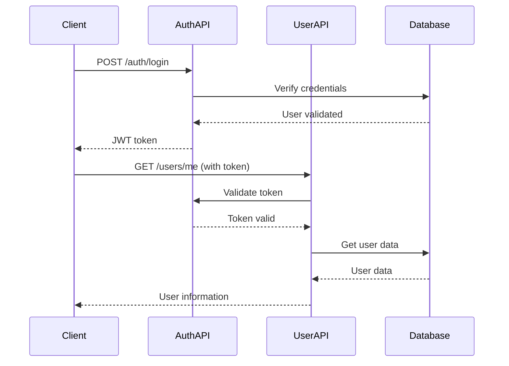

# API Directory 📡

This directory contains the API layer of the application, organizing all REST endpoints and routing logic.

## 🎯 Purpose

The `api/` directory handles all HTTP requests and responses, serving as the interface between external clients and the application's business logic.

## 📁 Directory Structure

```
api/
├── __init__.py          # Package initialization
└── v1/                  # API version 1
    ├── __init__.py      # Version package initialization
    ├── api.py           # Main API router configuration
    ├── auth_routes.py   # Authentication endpoints
    └── user_routes.py   # User management endpoints
```

## 📄 File Overview

### `v1/api.py` - Main API Router
**Purpose**: Central router that combines all API endpoints

**What it does**:
- Creates the main API router for version 1
- Includes authentication routes (`/auth`)
- Includes user management routes (`/users`)  
- Provides a single entry point for all API endpoints

**For beginners**: Think of this as the "traffic director" that decides which endpoint handles which request.

### `v1/auth_routes.py` - Authentication Endpoints
**Purpose**: Handles user login, logout, and authentication

**Available endpoints**:
- `POST /auth/login` - User login with username/password
- `POST /auth/logout` - User logout (invalidates token)
- `GET /auth/me` - Get current user information

**What it does**:
- Validates user credentials
- Creates JWT tokens for authentication
- Manages token blacklisting for security
- Returns user information for authenticated users

**For beginners**: This is where users "sign in" to use the app. It checks if the password is correct and gives them a "ticket" (JWT token) to access protected features.

### `v1/user_routes.py` - User Management Endpoints
**Purpose**: Handles all user-related operations (CRUD)

**Available endpoints**:
- `POST /users` - Create new user account
- `GET /users/{username}` - Get user information
- `PUT /users/{username}` - Update user profile
- `DELETE /users/{username}` - Delete user account
- `PUT /users/{username}/password` - Change user password

**What it does**:
- Creates new user accounts
- Retrieves user profiles
- Updates user information
- Deletes user accounts
- Handles password changes securely

**For beginners**: This is like a "user manager" that lets you create accounts, view profiles, update information, and delete accounts.

## 🔑 Authentication Flow



## 🛡️ Security Features

### Authentication Required
Most endpoints require authentication:
```python
# Protected endpoint example
@router.get("/users/{username}")
async def get_user(
    username: str,
    current_user: User = Depends(get_current_user)  # ← Authentication required
):
```

### Input Validation
All inputs are validated using Pydantic models:
```python
# Request validation
@router.post("/users")
async def create_user(user_data: UserRequest):  # ← Validates input automatically
```

### Error Handling
Consistent error responses:
- `400` - Bad Request (invalid input)
- `401` - Unauthorized (no token or invalid token)
- `403` - Forbidden (valid token, but no permission)
- `404` - Not Found (user doesn't exist)
- `409` - Conflict (username already exists)

## 🧩 How It Connects

### Input Flow
```
HTTP Request → FastAPI → API Router → Endpoint Function → Service Layer → Database
```

### Response Flow
```
Database → Service Layer → Endpoint Function → Pydantic Model → JSON Response
```

## 📝 Usage Examples

### Creating a User
```bash
curl -X POST "http://localhost:8000/api/v1/users" \
  -H "Content-Type: application/json" \
  -d '{
    "username": "johndoe",
    "password": "SecurePass123!",
    "age": 25,
    "description": "Software developer"
  }'
```

### Login
```bash
curl -X POST "http://localhost:8000/api/v1/auth/login" \
  -H "Content-Type: application/json" \
  -d '{
    "username": "johndoe",
    "password": "SecurePass123!"
  }'
```

### Get User Info (with authentication)
```bash
curl -X GET "http://localhost:8000/api/v1/users/johndoe" \
  -H "Authorization: Bearer YOUR_JWT_TOKEN_HERE"
```

## 🔧 For Developers

### Adding New Endpoints
1. Choose the appropriate router file (`auth_routes.py` or `user_routes.py`)
2. Add your endpoint function with proper decorators
3. Use Pydantic models for request/response validation
4. Add authentication dependency if needed
5. Handle errors appropriately
6. Update the router in `api.py` if needed

### Best Practices
- Always validate input using Pydantic models
- Use proper HTTP status codes
- Add authentication to protected endpoints
- Handle errors gracefully
- Document your endpoints with docstrings
- Keep business logic in the service layer

## 🎓 Learning Path

**Beginner**: Start by understanding what each endpoint does by reading the docstrings

**Intermediate**: Look at how endpoints use dependencies for authentication and validation

**Advanced**: Study the error handling patterns and security implementations

---

**Next**: Check out the [`services/`](../services/README.md) directory to see how the business logic works!