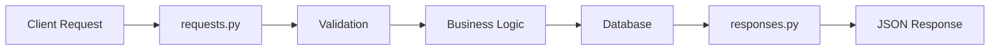

# Diretório Models 📋

Este diretório contém modelos de dados que definem a estrutura e regras de validação para todos os dados que fluem pela aplicação.

## 🎯 Propósito

O diretório `models/` garante que todos os dados entrando e saindo da sua API sejam adequadamente formatados, validados e seguros. Ele age como o "contrato de dados" entre sua API e os clientes.

## 📁 Estrutura do Diretório

```
models/
├── __init__.py          # Inicialização do pacote
├── requests.py          # Modelos de validação de entrada (o que ENTRA)
├── responses.py         # Modelos de formatação de saída (o que SAI)
├── user.py             # Classe simples de dados do usuário (legacy)
└── user_data.py        # Dados de amostra do usuário (DESCONTINUADO)
```

## 📄 Visão Geral dos Arquivos

### `requests.py` - Modelos de Validação de Entrada
**Propósito**: Valida todos os dados vindo PARA a API dos clientes

**O que faz**:
- Verifica se os nomes de usuário estão em formato válido
- Valida requisitos de força da senha
- Garante que a idade seja razoável (1-120)
- Valida comprimento da descrição
- Previne entrada maliciosa

**Para iniciantes**: Pense nisso como um "segurança" de uma boate - ele verifica se os dados entrando atendem todos os requisitos antes de deixá-los entrar na sua aplicação.

**Modelos incluídos**:
- `UserRequest` - Para criar novos usuários
- `LoginRequest` - Para login de usuário
- `PasswordChangeRequest` - Para alteração de senhas

### `responses.py` - Modelos de Formatação de Saída
**Propósito**: Formata todos os dados saindo DA API para os clientes

**O que faz**:
- Formata dados do usuário para respostas da API
- Exclui informações sensíveis (nunca envia senhas!)
- Fornece estrutura de resposta consistente
- Inclui tokens JWT para autenticação

**Para iniciantes**: Isso é como um "formatador" que garante que todas as respostas da sua API pareçam profissionais e consistentes, como usar um uniforme.

**Modelos incluídos**:
- `UserResponse` - Informações do usuário sem dados sensíveis
- `Token` - Informações do token JWT
- `LoginResponse` - Resposta completa de login com usuário + token

### `user.py` - Classe Simples de Usuário (Legacy)
**Propósito**: Classe Python básica para dados de usuário (abordagem antiga)

**Status**: Código legacy - código moderno usa modelos de banco de dados e modelos Pydantic

**Para iniciantes**: Essa é uma forma antiga de representar usuários. A nova abordagem usa os modelos de banco de dados e validação Pydantic em vez disso.

### `user_data.py` - Dados de Amostra (DESCONTINUADO)
**Propósito**: Contém usuários de amostra hardcoded

**⚠️ AVISO DE SEGURANÇA**: Contém senhas em texto plano - NÃO USE em produção!

**Status**: Descontinuado - use `database/init.py` em vez disso para dados de amostra

## 🛡️ Fluxo de Validação de Dados



## 📥 Request Models (Input Validation)

### `UserRequest` - Creating New Users
```python
{
    "username": "johndoe",        # 3-30 chars, alphanumeric + underscore
    "password": "SecurePass123!", # 8+ chars, mixed case, numbers, symbols
    "age": 25,                   # 1-120 years
    "description": "Developer"    # Optional, max 200 chars
}
```

**Validation Rules**:
- Username: 3-30 characters, letters, numbers, underscores only
- Password: 8+ characters, must have uppercase, lowercase, number, symbol
- Age: Must be between 1 and 120
- Description: Optional, maximum 200 characters

### `LoginRequest` - User Login
```python
{
    "username": "johndoe",
    "password": "SecurePass123!"
}
```

**Validation Rules**:
- Both fields required
- No empty strings allowed
- Username format validation

### `PasswordChangeRequest` - Changing Passwords
```python
{
    "current_password": "OldPass123!",
    "new_password": "NewPass456!",
    "confirm_password": "NewPass456!"
}
```

**Validation Rules**:
- All fields required
- New password must meet strength requirements
- Confirm password must match new password
- Current password verified separately in business logic

## 📤 Response Models (Output Formatting)

### `UserResponse` - User Information
```python
{
    "id": 1,
    "username": "johndoe",
    "age": 25,
    "description": "Developer"
    # Note: password is NEVER included!
}
```

**Security**: Passwords are never included in responses!

### `Token` - JWT Token Information
```python
{
    "access_token": "eyJ0eXAiOiJKV1QiLCJhbGciOiJIUzI1NiJ9...",
    "token_type": "bearer",
    "expires_in": 1800  # 30 minutes in seconds
}
```

### `LoginResponse` - Complete Login Response
```python
{
    "user": {
        "id": 1,
        "username": "johndoe",
        "age": 25,
        "description": "Developer"
    },
    "token": {
        "access_token": "eyJ0eXAiOiJKV1QiLCJhbGciOiJIUzI1NiJ9...",
        "token_type": "bearer",
        "expires_in": 1800
    }
}
```

## ✅ Validation Examples

### Valid User Creation
```python
# ✅ This will pass validation
user_data = {
    "username": "alice_smith",
    "password": "MySecure123!",
    "age": 28,
    "description": "Product Manager"
}
```

### Invalid Examples
```python
# ❌ Username too short
{
    "username": "al",  # Less than 3 characters
    "password": "MySecure123!",
    "age": 28
}

# ❌ Weak password
{
    "username": "alice_smith",
    "password": "password",  # No uppercase, numbers, or symbols
    "age": 28
}

# ❌ Invalid age
{
    "username": "alice_smith", 
    "password": "MySecure123!",
    "age": 150  # Over 120
}

# ❌ Description too long
{
    "username": "alice_smith",
    "password": "MySecure123!",
    "age": 28,
    "description": "A very long description that exceeds the 200 character limit and will be rejected by the validation system because it's simply too long for our database schema and application requirements."
}
```

## 🔧 How Validation Works

### Automatic Validation
```python
# FastAPI automatically validates using Pydantic models
@app.post("/users", response_model=UserResponse)
async def create_user(user_data: UserRequest):  # ← Validation happens here
    # If we reach this point, data is valid!
    pass
```

### Custom Validation
```python
class UserRequest(BaseModel):
    username: str = Field(..., min_length=3, max_length=30)
    password: str = Field(..., min_length=8)
    
    @validator('username')
    def validate_username(cls, v):
        if not re.match(r'^[a-zA-Z0-9_]+$', v):
            raise ValueError('Username can only contain letters, numbers, and underscores')
        return v
    
    @validator('password')
    def validate_password_strength(cls, v):
        if not re.search(r'[A-Z]', v):
            raise ValueError('Password must contain uppercase letter')
        if not re.search(r'[a-z]', v):
            raise ValueError('Password must contain lowercase letter')
        if not re.search(r'\d', v):
            raise ValueError('Password must contain number')
        if not re.search(r'[!@#$%^&*(),.?":{}|<>]', v):
            raise ValueError('Password must contain special character')
        return v
```

## 🛡️ Security Features

### Input Sanitization
- All string inputs are automatically trimmed
- Special characters in usernames are blocked
- SQL injection prevention through type validation
- XSS prevention through output encoding

### Password Security
- Minimum complexity requirements enforced
- Passwords never appear in response models
- Password confirmation required for changes
- Old password verification required

### Data Exposure Prevention
- Sensitive fields excluded from responses
- User IDs only shown to authenticated users
- No internal system information exposed

## 🧪 Testing Validation

### Valid Data Test
```python
def test_valid_user_request():
    data = {
        "username": "testuser",
        "password": "TestPass123!",
        "age": 25,
        "description": "Test user"
    }
    user_request = UserRequest(**data)
    assert user_request.username == "testuser"
```

### Invalid Data Test
```python
def test_invalid_password():
    data = {
        "username": "testuser",
        "password": "weak",  # Too weak
        "age": 25
    }
    
    with pytest.raises(ValidationError):
        UserRequest(**data)
```

## 🔄 Data Flow Example

### Creating a User
```python
# 1. Client sends JSON
POST /api/v1/users
{
    "username": "newuser",
    "password": "SecurePass123!",
    "age": 30
}

# 2. FastAPI validates using UserRequest model
# 3. If valid, business logic processes the data
# 4. User saved to database
# 5. Response formatted using UserResponse model
# 6. Client receives clean response (no password!)
{
    "id": 123,
    "username": "newuser", 
    "age": 30,
    "description": ""
}
```

## 🎓 Learning Path

**Beginner**: 
1. Understand the difference between request and response models
2. Look at the validation rules in each model
3. Try sending invalid data to see error messages
4. Notice how passwords never appear in responses

**Intermediate**: 
1. Study the custom validators and their regex patterns
2. Understand how Pydantic integrates with FastAPI
3. Learn about field validation and error handling
4. Practice creating your own validation rules

**Advanced**: 
1. Create custom validation decorators
2. Study the security implications of each validation rule
3. Learn about performance optimization for validation
4. Implement complex validation logic with dependencies

## 🚨 Common Validation Errors

### Error Response Format
```python
{
    "detail": [
        {
            "loc": ["body", "password"],
            "msg": "Password must contain uppercase letter",
            "type": "value_error"
        }
    ]
}
```

### Typical Client Errors
- **422 Unprocessable Entity**: Validation failed
- **400 Bad Request**: Malformed JSON
- **413 Request Entity Too Large**: Request too big

---

**Next**: Check out the [`services/`](../services/README.md) directory to see how business logic processes validated data!