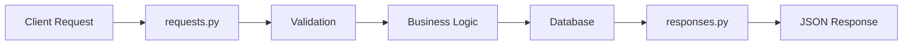

# Models Directory 📋

This directory contains data models that define the structure and validation rules for all data flowing through the application.

## 🎯 Purpose

The `models/` directory ensures that all data entering and leaving your API is properly formatted, validated, and secure. It acts as the "data contract" between your API and clients.

## 📁 Directory Structure

```
models/
├── __init__.py          # Package initialization
├── requests.py          # Input validation models (what comes IN)
├── responses.py         # Output formatting models (what goes OUT)
├── user.py             # Simple User data class (legacy)
└── user_data.py        # Sample user data (DEPRECATED)
```

## 📄 File Overview

### `requests.py` - Input Validation Models
**Purpose**: Validates all data coming INTO the API from clients

**What it does**:
- Checks if usernames are valid format
- Validates password strength requirements
- Ensures age is reasonable (1-120)
- Validates description length
- Prevents malicious input

**For beginners**: Think of this as a "bouncer" at a club - it checks if the data coming in meets all the requirements before letting it into your application.

**Models included**:
- `UserRequest` - For creating new users
- `LoginRequest` - For user login
- `PasswordChangeRequest` - For changing passwords

### `responses.py` - Output Formatting Models
**Purpose**: Formats all data going OUT of the API to clients

**What it does**:
- Formats user data for API responses
- Excludes sensitive information (never sends passwords!)
- Provides consistent response structure
- Includes JWT tokens for authentication

**For beginners**: This is like a "formatter" that makes sure all responses from your API look professional and consistent, like wearing a uniform.

**Models included**:
- `UserResponse` - User information without sensitive data
- `Token` - JWT token information
- `LoginResponse` - Complete login response with user + token

### `user.py` - Simple User Class (Legacy)
**Purpose**: Basic Python class for user data (older approach)

**Status**: Legacy code - modern code uses database models and Pydantic models

**For beginners**: This is an older way of representing users. The new approach uses the database models and Pydantic validation instead.

### `user_data.py` - Sample Data (DEPRECATED)
**Purpose**: Contains hardcoded sample users

**⚠️ SECURITY WARNING**: Contains plaintext passwords - DO NOT USE in production!

**Status**: Deprecated - use `database/init.py` instead for sample data

## 🛡️ Data Validation Flow



## 📥 Request Models (Input Validation)

### `UserRequest` - Creating New Users
```python
{
    "username": "johndoe",        # 3-30 chars, alphanumeric + underscore
    "password": "SecurePass123!", # 8+ chars, mixed case, numbers, symbols
    "age": 25,                   # 1-120 years
    "description": "Developer"    # Optional, max 200 chars
}
```

**Validation Rules**:
- Username: 3-30 characters, letters, numbers, underscores only
- Password: 8+ characters, must have uppercase, lowercase, number, symbol
- Age: Must be between 1 and 120
- Description: Optional, maximum 200 characters

### `LoginRequest` - User Login
```python
{
    "username": "johndoe",
    "password": "SecurePass123!"
}
```

**Validation Rules**:
- Both fields required
- No empty strings allowed
- Username format validation

### `PasswordChangeRequest` - Changing Passwords
```python
{
    "current_password": "OldPass123!",
    "new_password": "NewPass456!",
    "confirm_password": "NewPass456!"
}
```

**Validation Rules**:
- All fields required
- New password must meet strength requirements
- Confirm password must match new password
- Current password verified separately in business logic

## 📤 Response Models (Output Formatting)

### `UserResponse` - User Information
```python
{
    "id": 1,
    "username": "johndoe",
    "age": 25,
    "description": "Developer"
    # Note: password is NEVER included!
}
```

**Security**: Passwords are never included in responses!

### `Token` - JWT Token Information
```python
{
    "access_token": "eyJ0eXAiOiJKV1QiLCJhbGciOiJIUzI1NiJ9...",
    "token_type": "bearer",
    "expires_in": 1800  # 30 minutes in seconds
}
```

### `LoginResponse` - Complete Login Response
```python
{
    "user": {
        "id": 1,
        "username": "johndoe",
        "age": 25,
        "description": "Developer"
    },
    "token": {
        "access_token": "eyJ0eXAiOiJKV1QiLCJhbGciOiJIUzI1NiJ9...",
        "token_type": "bearer",
        "expires_in": 1800
    }
}
```

## ✅ Validation Examples

### Valid User Creation
```python
# ✅ This will pass validation
user_data = {
    "username": "alice_smith",
    "password": "MySecure123!",
    "age": 28,
    "description": "Product Manager"
}
```

### Invalid Examples
```python
# ❌ Username too short
{
    "username": "al",  # Less than 3 characters
    "password": "MySecure123!",
    "age": 28
}

# ❌ Weak password
{
    "username": "alice_smith",
    "password": "password",  # No uppercase, numbers, or symbols
    "age": 28
}

# ❌ Invalid age
{
    "username": "alice_smith", 
    "password": "MySecure123!",
    "age": 150  # Over 120
}

# ❌ Description too long
{
    "username": "alice_smith",
    "password": "MySecure123!",
    "age": 28,
    "description": "A very long description that exceeds the 200 character limit and will be rejected by the validation system because it's simply too long for our database schema and application requirements."
}
```

## 🔧 How Validation Works

### Automatic Validation
```python
# FastAPI automatically validates using Pydantic models
@app.post("/users", response_model=UserResponse)
async def create_user(user_data: UserRequest):  # ← Validation happens here
    # If we reach this point, data is valid!
    pass
```

### Custom Validation
```python
class UserRequest(BaseModel):
    username: str = Field(..., min_length=3, max_length=30)
    password: str = Field(..., min_length=8)
    
    @validator('username')
    def validate_username(cls, v):
        if not re.match(r'^[a-zA-Z0-9_]+$', v):
            raise ValueError('Username can only contain letters, numbers, and underscores')
        return v
    
    @validator('password')
    def validate_password_strength(cls, v):
        if not re.search(r'[A-Z]', v):
            raise ValueError('Password must contain uppercase letter')
        if not re.search(r'[a-z]', v):
            raise ValueError('Password must contain lowercase letter')
        if not re.search(r'\d', v):
            raise ValueError('Password must contain number')
        if not re.search(r'[!@#$%^&*(),.?":{}|<>]', v):
            raise ValueError('Password must contain special character')
        return v
```

## 🛡️ Security Features

### Input Sanitization
- All string inputs are automatically trimmed
- Special characters in usernames are blocked
- SQL injection prevention through type validation
- XSS prevention through output encoding

### Password Security
- Minimum complexity requirements enforced
- Passwords never appear in response models
- Password confirmation required for changes
- Old password verification required

### Data Exposure Prevention
- Sensitive fields excluded from responses
- User IDs only shown to authenticated users
- No internal system information exposed

## 🧪 Testing Validation

### Valid Data Test
```python
def test_valid_user_request():
    data = {
        "username": "testuser",
        "password": "TestPass123!",
        "age": 25,
        "description": "Test user"
    }
    user_request = UserRequest(**data)
    assert user_request.username == "testuser"
```

### Invalid Data Test
```python
def test_invalid_password():
    data = {
        "username": "testuser",
        "password": "weak",  # Too weak
        "age": 25
    }
    
    with pytest.raises(ValidationError):
        UserRequest(**data)
```

## 🔄 Data Flow Example

### Creating a User
```python
# 1. Client sends JSON
POST /api/v1/users
{
    "username": "newuser",
    "password": "SecurePass123!",
    "age": 30
}

# 2. FastAPI validates using UserRequest model
# 3. If valid, business logic processes the data
# 4. User saved to database
# 5. Response formatted using UserResponse model
# 6. Client receives clean response (no password!)
{
    "id": 123,
    "username": "newuser", 
    "age": 30,
    "description": ""
}
```

## 🎓 Learning Path

**Beginner**: 
1. Understand the difference between request and response models
2. Look at the validation rules in each model
3. Try sending invalid data to see error messages
4. Notice how passwords never appear in responses

**Intermediate**: 
1. Study the custom validators and their regex patterns
2. Understand how Pydantic integrates with FastAPI
3. Learn about field validation and error handling
4. Practice creating your own validation rules

**Advanced**: 
1. Create custom validation decorators
2. Study the security implications of each validation rule
3. Learn about performance optimization for validation
4. Implement complex validation logic with dependencies

## 🚨 Common Validation Errors

### Error Response Format
```python
{
    "detail": [
        {
            "loc": ["body", "password"],
            "msg": "Password must contain uppercase letter",
            "type": "value_error"
        }
    ]
}
```

### Typical Client Errors
- **422 Unprocessable Entity**: Validation failed
- **400 Bad Request**: Malformed JSON
- **413 Request Entity Too Large**: Request too big

---

**Next**: Check out the [`services/`](../services/README.md) directory to see how business logic processes validated data!