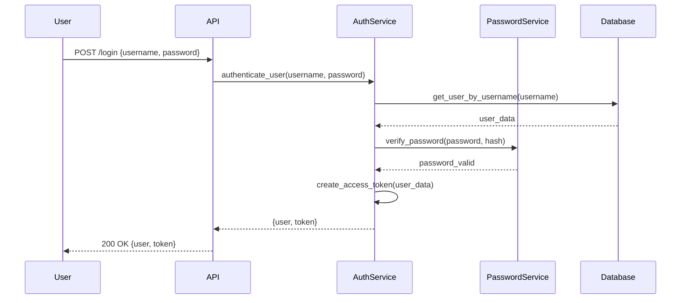

# Services Directory 🔧

This directory contains the business logic layer of the application - the "brain" that processes requests and makes decisions.

## 🎯 Purpose

The `services/` directory handles all the complex business logic, keeping it separate from the API endpoints and database operations. This makes the code more organized, testable, and maintainable.

## 📁 Directory Structure

```
services/
├── __init__.py          # Package initialization
├── auth_service.py      # Authentication and JWT token management
├── password_service.py  # Password hashing and verification
└── user_service.py      # User business logic and operations
```

## 📄 File Overview

### `auth_service.py` - Authentication Service
**Purpose**: Handles user authentication, JWT tokens, and security

**What it does**:
- Verifies user login credentials
- Creates JWT tokens for authenticated users
- Validates and refreshes tokens
- Manages token blacklisting (logout)
- Provides user authentication for protected endpoints

**For beginners**: Think of this as the "security guard" of your application. It checks if users are who they say they are and gives them a "pass" (JWT token) to access protected areas.

**Key Functions**:
- `authenticate_user()` - Checks username/password
- `create_access_token()` - Creates JWT tokens
- `verify_token()` - Validates JWT tokens
- `blacklist_token()` - Logs out users
- `get_current_user()` - Gets user from token

### `password_service.py` - Password Security
**Purpose**: Handles secure password hashing and verification

**What it does**:
- Hashes passwords using bcrypt (very secure!)
- Verifies passwords during login
- Uses configurable security levels
- Protects against rainbow table attacks

**For beginners**: This is like a "password safe" that scrambles passwords so they can't be read by hackers, but can still verify if a password is correct.

**Key Functions**:
- `hash_password()` - Converts plain password to secure hash
- `verify_password()` - Checks if password matches hash

### `user_service.py` - User Business Logic
**Purpose**: Handles all user-related business operations

**What it does**:
- Creates new user accounts
- Retrieves user information
- Updates user profiles
- Deletes user accounts
- Handles password changes
- Enforces business rules

**For beginners**: This is the "user manager" that handles everything related to user accounts - creating them, updating them, and making sure all the rules are followed.

**Key Functions**:
- `create_user()` - Creates new user accounts
- `get_user_by_username()` - Finds users
- `update_user()` - Updates user information
- `delete_user()` - Removes user accounts
- `change_user_password()` - Changes passwords securely

## 🔐 Authentication Flow



## 🛡️ Security Features

### Password Security
```python
# ✅ Secure password hashing
from services.password_service import hash_password, verify_password

# Hash password before storing
hashed = hash_password("user_password")
# Result: "$2b$12$LQv3c1yqBWVHxkd0LHAkCOYz6TtxMQJqhN8/LewdBPj7RG6V8K2.y"

# Verify password during login
is_valid = verify_password("user_password", hashed)
# Result: True or False
```

### JWT Token Security
```python
# ✅ Secure token creation
from services.auth_service import create_access_token

token = create_access_token({"sub": "username"})
# Creates secure JWT token with expiration
```

### Token Blacklisting
```python
# ✅ Secure logout
from services.auth_service import blacklist_token

await blacklist_token(token)
# Token becomes invalid immediately
```

## 🏗️ Business Logic Examples

### User Registration Process
```python
async def register_user_example(username: str, password: str, age: int):
    # 1. Check if username already exists
    existing_user = await user_service.get_user_by_username(username)
    if existing_user:
        raise ValueError("Username already exists")
    
    # 2. Hash password securely
    hashed_password = password_service.hash_password(password)
    
    # 3. Create user in database
    new_user = await user_service.create_user({
        "username": username,
        "password": hashed_password,
        "age": age
    })
    
    return new_user
```

### Login Process
```python
async def login_example(username: str, password: str):
    # 1. Authenticate user
    user = await auth_service.authenticate_user(username, password)
    if not user:
        raise ValueError("Invalid credentials")
    
    # 2. Create JWT token
    token = auth_service.create_access_token({"sub": user.username})
    
    # 3. Return user and token
    return {
        "user": user,
        "token": token
    }
```

### Password Change Process
```python
async def change_password_example(username: str, old_password: str, new_password: str):
    # 1. Verify current password
    user = await auth_service.authenticate_user(username, old_password)
    if not user:
        raise ValueError("Current password is incorrect")
    
    # 2. Hash new password
    new_hash = password_service.hash_password(new_password)
    
    # 3. Update in database
    await user_service.change_user_password(username, new_hash)
    
    return True
```

## ⚡ Performance Considerations

### Password Hashing Performance
```python
# Configurable security levels
BCRYPT_ROUNDS = 12  # Default: ~50ms per hash

# Development: 10 rounds (~10ms) - faster testing
# Production: 12-13 rounds (~50-100ms) - more secure
# High-security: 14-15 rounds (~200-400ms) - maximum security
```

### Token Caching
```python
# JWT tokens are stateless - no database lookup needed for verification
# Only blacklisted tokens require database check
```

### Database Optimization
```python
# User lookups optimized with database indexes
# Username searches are fast due to unique index
```

## 🧪 Testing Business Logic

### Testing Authentication
```python
import pytest
from services.auth_service import authenticate_user

@pytest.mark.asyncio
async def test_valid_authentication():
    # Test with valid credentials
    user = await authenticate_user("testuser", "correct_password")
    assert user is not None
    assert user.username == "testuser"

@pytest.mark.asyncio  
async def test_invalid_authentication():
    # Test with invalid credentials
    user = await authenticate_user("testuser", "wrong_password")
    assert user is None
```

### Testing Password Security
```python
from services.password_service import hash_password, verify_password

def test_password_hashing():
    password = "MySecretPassword123!"
    hashed = hash_password(password)
    
    # Hash should be different from original
    assert hashed != password
    
    # Should verify correctly
    assert verify_password(password, hashed) == True
    
    # Should reject wrong password
    assert verify_password("wrong_password", hashed) == False
```

### Testing User Operations
```python
import pytest
from services.user_service import create_user, get_user_by_username

@pytest.mark.asyncio
async def test_user_creation():
    user_data = {
        "username": "newuser",
        "password": "hashed_password",
        "age": 25,
        "description": "Test user"
    }
    
    user = await create_user(user_data)
    assert user.username == "newuser"
    assert user.age == 25
```

## 🔄 Service Layer Benefits

### Separation of Concerns
```python
# ❌ Bad: Business logic in API endpoint
@app.post("/users")
async def create_user_endpoint(user_data: UserRequest):
    # Check if user exists (business logic)
    existing = await db.execute(select(User).where(User.username == user_data.username))
    if existing.scalar_one_or_none():
        raise HTTPException(400, "User exists")
    
    # Hash password (business logic)
    hashed = bcrypt.hashpw(user_data.password.encode(), bcrypt.gensalt())
    
    # Save to database (business logic)
    # ... more code in API endpoint

# ✅ Good: Business logic in service layer
@app.post("/users")
async def create_user_endpoint(user_data: UserRequest):
    # API only handles HTTP concerns
    try:
        user = await user_service.create_user(user_data.dict())
        return UserResponse.from_orm(user)
    except ValueError as e:
        raise HTTPException(400, str(e))
```

### Reusability
```python
# Service functions can be used by:
# - API endpoints
# - Background tasks
# - CLI commands
# - Tests
# - Other services
```

### Testability
```python
# Services can be tested independently
# No need to start HTTP server
# Easy to mock dependencies
# Fast test execution
```

## 🚨 Error Handling

### Service-Level Errors
```python
# Services raise Python exceptions
class UserNotFoundError(Exception):
    pass

class InvalidCredentialsError(Exception):
    pass

class UserAlreadyExistsError(Exception):
    pass
```

### API-Level Error Conversion
```python
# API endpoints convert service exceptions to HTTP responses
try:
    user = await user_service.get_user_by_username(username)
except UserNotFoundError:
    raise HTTPException(404, "User not found")
except Exception:
    raise HTTPException(500, "Internal server error")
```

## 🎓 Learning Path

**Beginner**: 
1. Understand what each service does
2. Look at the function signatures and docstrings
3. See how services are used in API endpoints
4. Try calling service functions in tests

**Intermediate**: 
1. Study the business logic patterns
2. Understand error handling strategies
3. Learn about password security best practices
4. Practice writing service tests

**Advanced**: 
1. Study the JWT token implementation
2. Learn about async patterns and performance
3. Understand security considerations
4. Design new service functions

## 🔗 Integration with Other Layers

### API Layer Uses Services
```python
# api/v1/user_routes.py
from services.user_service import create_user

@router.post("/users")
async def create_user_endpoint(user_data: UserRequest):
    user = await create_user(user_data.dict())
    return UserResponse.from_orm(user)
```

### Services Use Database
```python
# services/user_service.py
from database.connection import get_db, User

async def create_user(user_data: dict):
    async with get_db() as session:
        user = User(**user_data)
        session.add(user)
        await session.commit()
        return user
```

### Services Use Configuration
```python
# services/auth_service.py
from config import settings

def create_access_token(data: dict):
    return jwt.encode(
        data,
        settings.jwt.secret_key,
        algorithm=settings.jwt.algorithm
    )
```

---

**Next**: Check out the [`utils/`](../utils/README.md) directory to see helpful utilities and middleware!